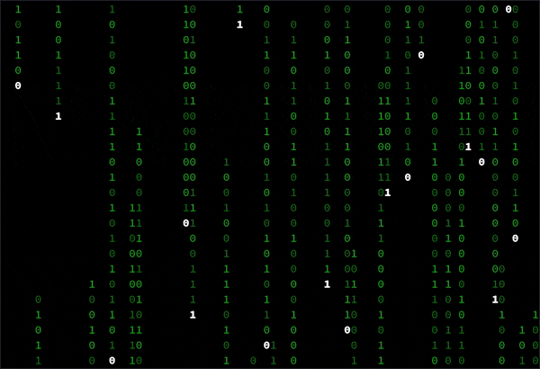

# neo

<p align="center">
  
</p>

This project implements a [Matrix digital rain][1] screensaver that runs within
the terminal. The [ncurses][2] library is used to render the screensaver.

### Building

To build the project, you will need:

* A C++ compiler supporting C++20 features
* CMake3.13+
* ncurses dev packages

To build, navigate to the `scripts/` directory and run the build script:
```bash
./build.sh
```

> **Note**
> `build.sh` supports additional option flags for building the project docs
> (requires [Doxygen][3]) and unit tests. Run `build.sh -h` to see all the
> options.

After the build completes, `neo` will be installed to `neo/bin/`.

### Program Usage

To launch the screensaver, run the `neo` binary in your terminal:

```bash
./neo
```

> **Note**
> `neo` assumes that the host terminal has color support.

### Running the Tests

`neo` has been unit tested using the GoogleTest framework in conjunction with
`ctest`. Be sure to run submodule init/update or clone the repo using the
`--recursive` flag to pull down GoogleTest sources.

To build the unit tests, run the build script as before with the addition of the
`-t` flag:

```bash
./build.sh -t
```

To run the test, change directory to `neo/build` and run `ctest`.

[1]: https://en.wikipedia.org/wiki/Matrix_digital_rain
[2]: https://en.wikipedia.org/wiki/Ncurses
[3]: https://www.doxygen.nl/index.html
